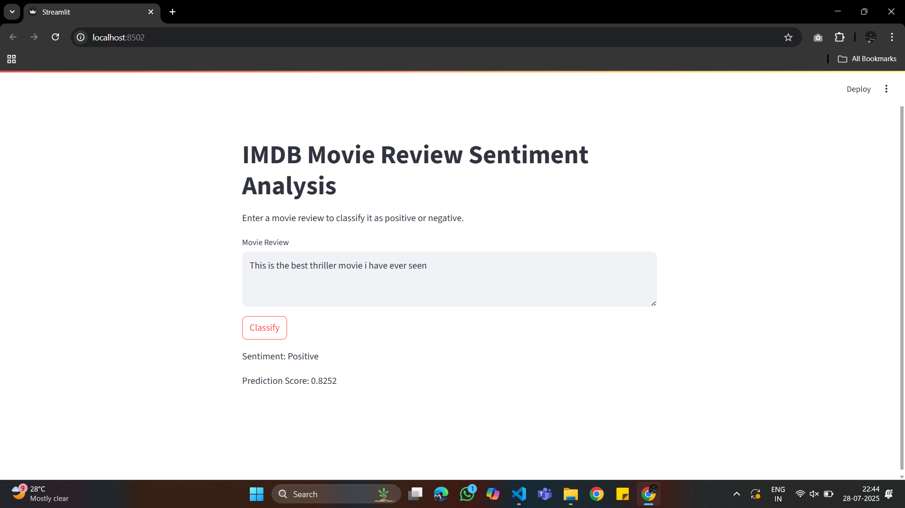

# IMDB Movie Review Sentiment Analysis (RNN)

This project implements a Sentiment Analysis model using a Recurrent Neural Network (RNN) on the IMDB movie reviews dataset. The model is built with TensorFlow/Keras and provides a web interface using Streamlit for classifying user-input movie reviews as positive or negative.
**The trained model achieves an accuracy of approximately 95%.**

## Demo



## Features

# IMDB Movie Review Sentiment Analysis (RNN)

This project implements a Sentiment Analysis model using a Recurrent Neural Network (RNN) on the IMDB movie reviews dataset. The model is built with TensorFlow/Keras and provides a web interface using Streamlit for classifying user-input movie reviews as positive or negative.

## Features

- RNN-based sentiment classification using IMDB dataset
- Preprocessing and padding of text data
- Early stopping during training to prevent overfitting
- Model saving and loading (`sentimental.keras`)
- Interactive web app for real-time sentiment prediction

## Project Structure

```
.
├── app.py                  # Streamlit web app for sentiment prediction
├── requirements.txt        # Python dependencies
├── sentimental.keras       # Saved Keras model
├── SentimentAnalysis.ipynb # Jupyter notebook for model training
```

## Installation

1. **Clone the repository:**
   ```bash
   git clone <your-repo-url>
   cd RNN_Project
   ```

2. **Install dependencies:**
   ```bash
   pip install -r requirements.txt
   ```

## Model Training

The model is trained in the `SentimentAnalysis.ipynb` notebook:

- Loads and preprocesses the IMDB dataset
- Pads sequences to a fixed length
- Builds an RNN model with an Embedding layer, SimpleRNN, and Dense output
- Uses EarlyStopping for better generalization
- Trains and saves the model as `sentimental.keras`

## Running the Web App

To launch the Streamlit web app for sentiment prediction:

```bash
streamlit run app.py
```

- Enter a movie review in the text area.
- Click "Classify" to see if the review is positive or negative.

## Usage Example

1. Open the app in your browser (Streamlit will provide a local URL).
2. Enter a review, e.g.,  
   ```
   This movie was fantastic! The performances were brilliant and the story was gripping.
   ```
3. Click "Classify" to get the sentiment and prediction score.

## Requirements

- Python 3.7+
- See `requirements.txt` for all dependencies.

## Files

- `app.py`: Streamlit app for user interaction and prediction.
- `SentimentAnalysis.ipynb`: Notebook for data loading, preprocessing, model building, training, and saving.
- `sentimental.keras`: Trained Keras model file.
- `requirements.txt`: List of required Python packages.

## License

This project is for educational purposes.
